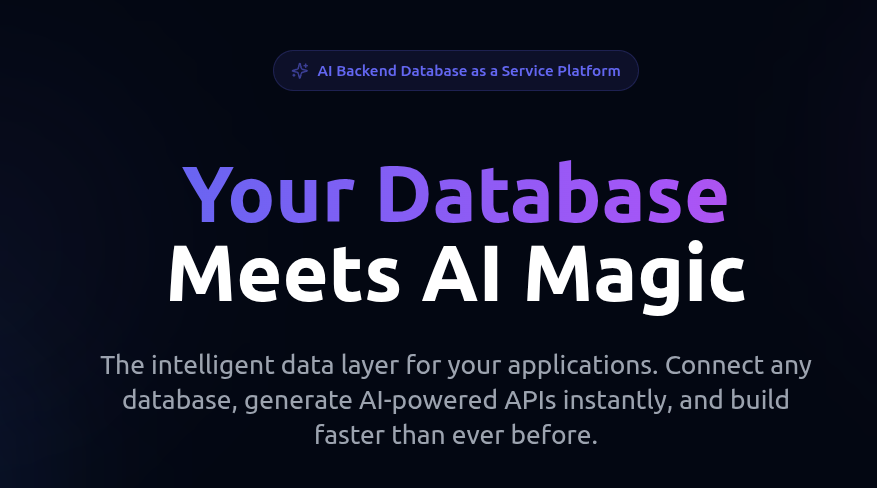
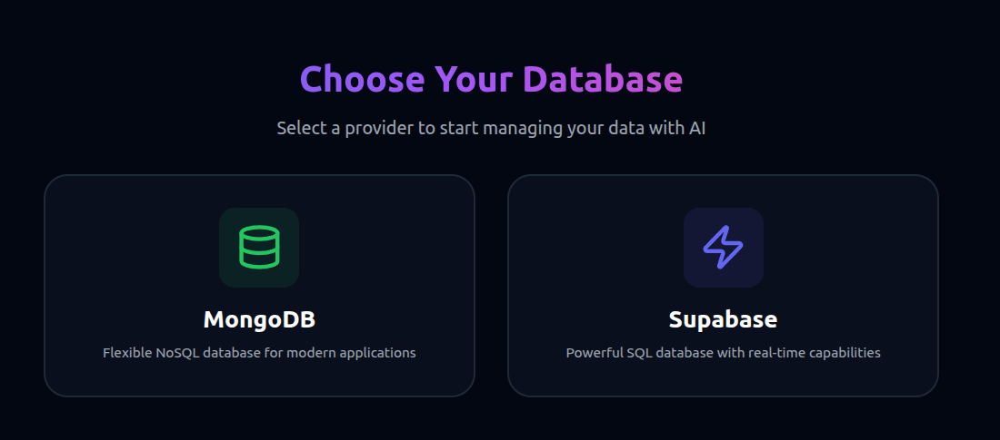
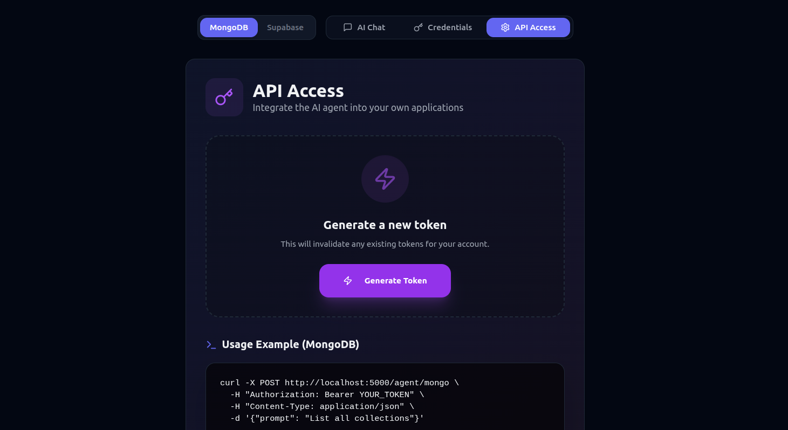

# Querio - AI Backend Database as a Service

**Querio** is a powerful Backend Database as a Service (DBaaS) platform that transforms your existing databases into intelligent, AI-powered API layers. Connect your database and start using natural language to query, manage, and integrate data into your services instantly.

Currently supports **MongoDB** and **Supabase (PostgreSQL)**.



## 🚀 Features

-   **AI-Powered API Generation**: Instantly turn your database into a RESTful API that understands natural language.
-   **Natural Language Queries**: Query your data using plain English—no SQL or NoSQL knowledge required.
-   **Multi-Database Support**: Seamlessly connect and manage PostgreSQL (Supabase) and MongoDB.
-   **Developer-First SDKs**: Easy integration into your existing services with simple API tokens.
-   **Secure & Encrypted**: Enterprise-grade security with encrypted credentials and isolated environments.
-   **Premium UI**: A modern, responsive dashboard built with React, Tailwind CSS, and Shadcn UI.





## 🛠️ Tech Stack

-   **Frontend**: React, Vite, TypeScript, Tailwind CSS, Shadcn UI, Lucide React.
-   **Backend**: Node.js, Express.js.
-   **Database**: MongoDB (for storing user accounts, encrypted configs, and chat history).
-   **AI Engine**: OpenAI Agents SDK (`gpt-4o-mini`).
-   **Authentication**: JWT (JSON Web Tokens).

## 📋 Prerequisites

-   **Node.js** (v18 or higher)
-   **MongoDB**: You need a MongoDB instance for the application's own data (users, history).
-   **OpenAI API Key**: Required for the AI agent functionality.

## ⚙️ Installation & Setup

### 1. Clone the Repository

```bash
git clone https://github.com/Bhushan21z/ai-db-connector.git
cd ai-db-connector
```

### 2. Backend Setup

1.  Navigate to the root directory (if not already there).
2.  Install dependencies:
    ```bash
    npm install
    ```
3.  Create a `.env` file in the root directory:
    ```env
    PORT=5000
    MONGO_AUTH_URI=mongodb://localhost:27017 # URI for the app's internal DB
    MONGO_DB_NAME=ai_agent_db            # Name for the app's internal DB
    JWT_SECRET=your_super_secret_jwt_key
    OPENAI_API_KEY=sk-...                # Your OpenAI API Key
    ```
4.  Start the backend server:
    ```bash
    node app.js
    ```
    The server will start on `http://localhost:5000`.

### 3. Frontend Setup

1.  Navigate to the frontend directory:
    ```bash
    cd frontend
    ```
2.  Install dependencies:
    ```bash
    npm install
    ```
3.  Create a `.env` file in the `frontend` directory:
    ```env
    VITE_BACKEND_URL=http://localhost:5000
    ```
4.  Start the development server:
    ```bash
    npm run dev
    ```
    The frontend will be available at `http://localhost:5173`.

## 📖 Usage Guide

### 1. Registration & Login
-   Open the frontend application.
-   Sign up for a new account.
-   Log in to access the dashboard.

### 2. Connect Your Database
-   Go to the **Credentials** tab.
-   Select your provider (currently **MongoDB**).
-   Enter your **Connection URI** (e.g., `mongodb+srv://...`).
-   Enter the **Database Name** you want to query.
-   Click **Save & Connect**. Your credentials are encrypted and saved.

### 3. Chat with Your Data
-   Switch to the **AI Chat** tab.
-   Type your request in plain English.
    -   *Example*: "List all collections in the database."
    -   *Example*: "Find the user with email 'test@example.com'."
    -   *Example*: "Update the status of order #123 to 'shipped'."
-   The AI will execute the operation and show you the results in a structured format.

### 4. External API Access
-   Go to the **API Access** tab.
-   Click **Generate API Token**.
-   Copy the token. **Keep it safe!**
-   You can now make requests to the agent from any external tool (like cURL, Postman, or your own app).

#### API Example (cURL)

```bash
curl -X POST http://localhost:5000/agent/mongo \
  -H "Authorization: Bearer <YOUR_API_TOKEN>" \
  -H "Content-Type: application/json" \
  -d '{"prompt": "Count the number of documents in the users collection"}'
```

**Response:**
```json
{
  "success": true,
  "prompt": "Count the number of documents in the users collection",
  "finalOutput": {
    "operation": "count_documents",
    "collection": "users",
    "affected": 42,
    "status": "Success",
    "data": null
  }
}
```

## 🤝 Contributing

Contributions are welcome! Please feel free to submit a Pull Request.

## 📄 License

This project is licensed under the MIT License.
